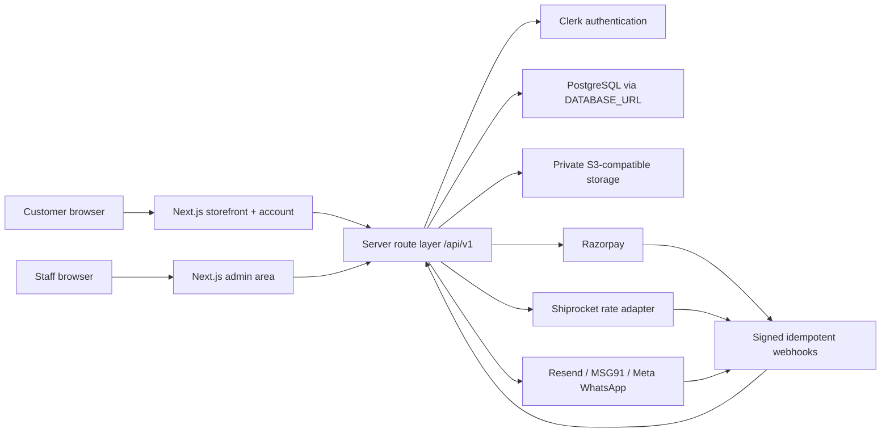
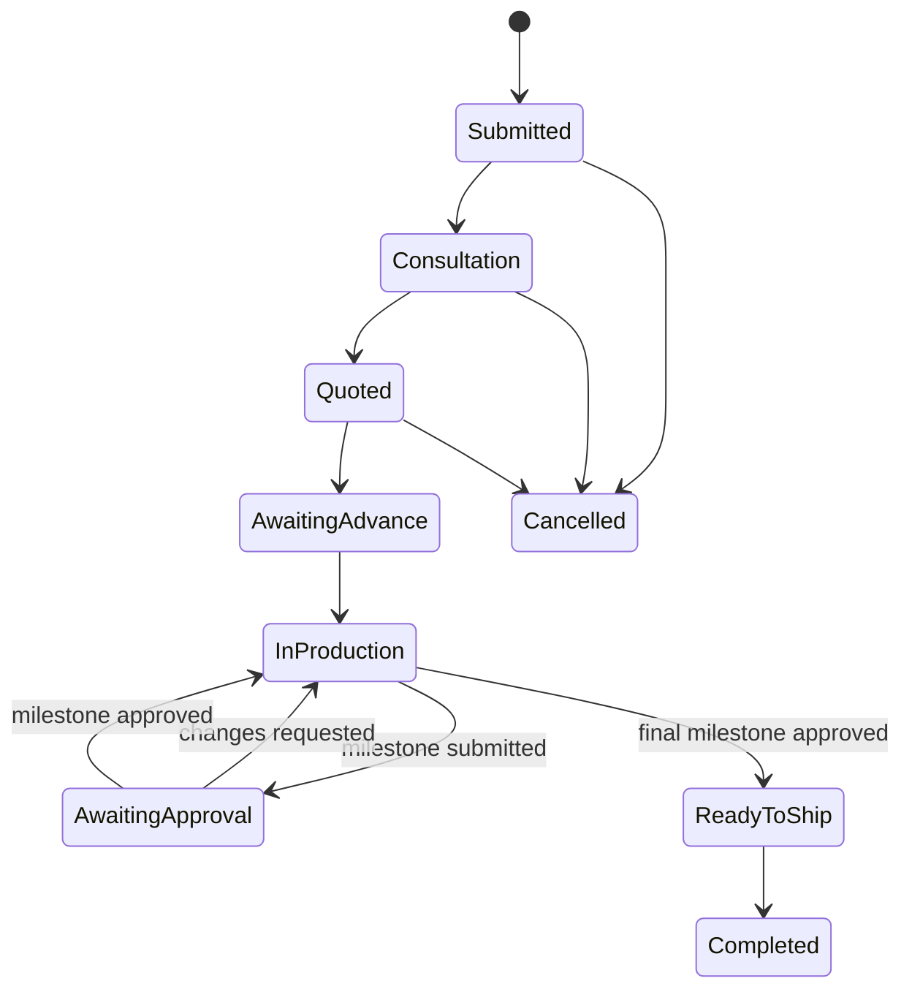

# Divine Stone Gallery — Production Architecture

## Scope and decisions

This architecture supports the agreed India-first business model:

- ready-made moortis can be purchased directly or submitted for a quotation;
- an account is required before an order is placed;
- sign-in will support phone OTP, email/password and Google;
- online payment, bank transfer and Cash on Delivery are supported;
- COD requires a verified phone number and staff approval;
- listed prices exclude GST and shipping, which are displayed as separate totals;
- shipping is calculated from destination postcode, dimensions and weight;
- stock includes both one-of-one sculptures and repeatable designs with variants;
- unique stock is reserved immediately during order placement;
- custom commission advances are set individually by staff;
- customers approve every major commission milestone;
- milestone and order updates are sent by WhatsApp, email and SMS;
- every staff account has full administrative access for the initial release;
- reviews require staff moderation before publication;
- tax invoices/credit notes preserve GST components and immutable billing details;
- returns are opened as staff-reviewed cases rather than automatically approved;
- customer and staff uploads are stored as media objects, not database blobs;
- the storefront language is English and the launch market/currency are India/INR.

## System shape

The storefront and admin area live in one application, but all authoritative writes pass through server routes. Browser storage may keep temporary UI preferences, but it is not the source of truth for accounts, wishlist items, carts, stock, orders or commission progress.

Signed-out visitors may build a temporary wishlist and enquiry bag in browser storage. On the first authenticated collection request, those product IDs are validated and merged idempotently into the customer's PostgreSQL wishlist and active quote-intent cart. Local values are erased only after the server confirms the merge; from then on, every mutation is authorized from the Clerk token and written to PostgreSQL.

## Persistence

Runtime resources are provider-neutral: `DATABASE_URL` connects PostgreSQL and the `S3_*` variables connect private object storage. Vercel and AWS supply these values through their encrypted environment settings.

`db/schema.ts` is the canonical Drizzle schema. Generated SQL lives in `drizzle/` and must be reviewed before it is applied. `db/index.ts` is the only database connection entry point. `storage/media.ts` is the media adapter entry point.

Database conventions:

- IDs are opaque text IDs generated by the application;
- timestamps are Unix seconds in UTC;
- money is integer paise and currency is `INR`;
- physical measurements are integer millimetres and grams;
- address and product snapshots are preserved on orders so historical invoices do not change;
- provider webhook IDs are unique to make retries idempotent;
- staff mutations create audit records;
- tax documents retain CGST, SGST and IGST as separate immutable paise amounts;
- PostgreSQL foreign keys, checks, partial unique indexes and transactional batches enforce data integrity.

## Authentication and authorization

Clerk is the selected authentication provider. The database stores the internal user and its Clerk identity mapping; it does not store passwords or OTP codes. Clerk must:

1. verify phone OTP, email/password or Google identity;
2. issue a secure, `HttpOnly`, `Secure`, `SameSite=Lax` server session;
3. return a stable provider subject that maps to `auth_identities`;
4. prevent account linking unless ownership of both identities is proven.

Clerk's signed session token is verified on the server for every protected request. The `user.created`, `user.updated` and `user.deleted` webhooks synchronize the customer record, while a synchronous post-login preparation call removes webhook timing from checkout. Route handlers enforce ownership and staff access on every request; hiding controls in the UI is not authorization.

Initial roles are deliberately simple:

- `customer`: owns addresses, wishlist, cart, quotes, orders, commissions and reviews;
- `staff/full_access`: can manage the complete catalog and business workflow.

Even with full staff access, sensitive changes are recorded in `audit_logs`.

## Order transaction

Order placement is one atomic server operation:

1. require an authenticated active account;
2. load current variants and reject stale prices or unavailable stock;
3. calculate subtotal, GST and shipping independently on the server;
4. validate the chosen payment method;
5. require verified phone ownership for COD;
6. reserve/decrement unique inventory and create the order in one transaction/batch;
7. mark COD orders `approval_pending`; other valid orders become `placed`;
8. create payment and notification jobs;
9. return the order number only after the durable write succeeds.

Never trust totals, GST, shipping charges or inventory flags sent by the browser. Repeated checkout requests use an idempotency key so they cannot create duplicate orders.

### Unique inventory rule

One-of-one variants use a partial unique reservation index. The application releases expired checkout reservations, converts the reservation on successful order creation, and never returns the piece to stock without an explicit cancellation/return action by staff.

### COD rule

COD is offered for all ready-made variants, subject to:

- verified phone OTP;
- a successful shipping quote;
- stock reservation;
- staff approval after placement.

A rejected COD request cancels the order and releases inventory through the same server transaction.

## Custom commission workflow

Staff sets the quotation and advance amount separately for each commission. References uploaded through the website or received through WhatsApp are copied to S3-compatible storage and linked to the commission. Every major milestone contains its own media and approval state. Customer approval or a change request is an authenticated, audited action.

## Integration boundaries

Business logic calls narrow adapters rather than exposing provider SDKs throughout the application:

- `Clerk`: phone OTP, email/password, Google identity, account linking and signed sessions;
- `PaymentProvider`: create/verify/capture/refund a payment;
- `ShiprocketShippingProvider`: authenticate server-side and return domestic surface rates from postcode, per-parcel packed dimensions, weight, declared value and COD/prepaid mode;
- `EmailProvider`, `SmsProvider`, `WhatsAppProvider`: deliver queued, templated messages through Resend, MSG91 and Meta;
- `MediaService`: validate type/size, issue upload permission, record the S3-compatible storage object.

Incoming Clerk and Razorpay webhooks require signature verification and idempotency records before business state changes. Notification delivery uses a high-entropy worker credential, retry scheduling and staff-visible failure state.

## Media rules

- Allowed customer image formats are JPEG, PNG and WebP. Video and PDF uploads are not accepted in the initial release.
- The server validates MIME signature and byte size, not only the file extension.
- S3-compatible storage object keys are generated by the server and never contain the original filename.
- Private custom references use authenticated download routes or short-lived signed access.
- Product assets can be public after staff approval and optimization.
- PostgreSQL stores ownership, object key, dimensions, type, checksum and processing status.

## Environments and secrets

Use separate local, staging and production resources. Only non-secret business identity values belong in `.env.example`. Authentication keys, payment keys, webhook signing secrets, messaging credentials and shipping credentials are server-only environment secrets. No `NEXT_PUBLIC_` variable may contain a secret.

The production canonical origin is `https://divinestonegallery.com`; local development remains `http://localhost:3000`. A staging site must use isolated PostgreSQL/S3-compatible storage resources and provider test modes. `npm run deploy:check` rejects an incomplete production configuration before release verification can pass.

## Current implementation status

Implemented in the application:

1. Clerk authentication, protected customer preparation and staff authorization.
2. PostgreSQL and S3-compatible catalogue persistence, seeded catalogue, public reads and product administration.
3. Account-backed wishlist and enquiry-bag endpoints with signed-out collection migration.
4. Transaction-safe checkout validation, idempotent order placement, inventory decrement, payment records and customer order history.
5. Shiprocket surface-rate integration, per-work package calculation, 30-minute PostgreSQL quotes and manual freight fallback.
6. Razorpay intent, browser verification and signed idempotent payment webhook handling.
7. Custom commission submission, quotation, milestone media, customer approval and staff management.
8. Retried Resend, MSG91 and Meta WhatsApp delivery, including durable WhatsApp consent and withdrawal history.
9. Security headers, request limits, SEO metadata, accessibility improvements and automated regression checks.
10. A fail-closed production configuration gate and documented release workflow.

Production provider credentials, approved messaging templates, legal business details, DNS and final live transaction tests remain deployment activities. See [deployment.md](deployment.md) and [launch-readiness.md](launch-readiness.md).
