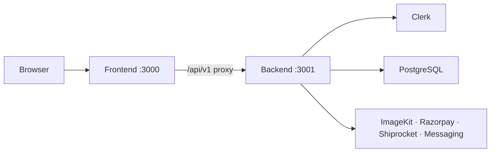

# Project structure

```text
Divinestonegallery/
├── apps/
│   ├── frontend/
│   │   ├── app/                    # Website, account and admin page routes
│   │   ├── public/                 # Logos, videos and catalogue images
│   │   └── src/
│   │       ├── authentication/     # Public Clerk configuration only
│   │       ├── components/         # Reusable site and UI components
│   │       ├── config/             # Brand, public business and site settings
│   │       ├── features/           # UI grouped by business feature
│   │       └── server/             # Server-only backend API client
│   └── backend/
│       ├── app/api/                # Next.js route handlers; no page UI
│       └── src/modules/
│           ├── admin/              # Dashboard and business settings
│           ├── auth/               # Clerk verification and authorization
│           ├── catalog/            # Products, variants, taxonomy and stock
│           ├── checkout/           # Cart validation and order creation
│           ├── cms/                # Page builder and media repositories
│           ├── collections/        # Wishlist and enquiry bag
│           ├── commerce/           # Orders, returns and operations
│           ├── commissions/        # Custom-moorti workflow
│           ├── messaging/          # Email, SMS and WhatsApp queue
│           ├── payments/           # Razorpay adapter and payment service
│           ├── security/           # Request limits and validation helpers
│           ├── shipping/           # Shiprocket rates
│           └── storage/            # Image validation and media adapter
├── packages/
│   ├── database/
│   │   ├── src/index.ts            # Only PostgreSQL connection entry point
│   │   ├── src/schema.ts           # Canonical Drizzle schema
│   │   └── drizzle/                # SQL migrations and migration journal
│   └── shared/src/                 # Types safe for both applications
├── scripts/                        # Local orchestration and release checks
├── tests/                          # Unit and end-to-end regression tests
└── docs/                           # Architecture and operating guides
```

## Where to make common changes

| Change | Location |
| --- | --- |
| Public page layout | `apps/frontend/app` |
| Header, footer or reusable control | `apps/frontend/src/components` |
| Shop, checkout or admin UI | `apps/frontend/src/features` |
| API endpoint | `apps/backend/app/api/v1` |
| Product/order/commission logic | matching folder in `apps/backend/src/modules` |
| Table or index | `packages/database/src/schema.ts` |
| SQL migration | `packages/database/drizzle` |
| Type used by both apps | `packages/shared/src` |
| Logo, photo or video | `apps/frontend/public` |

## Request flow



Frontend server components also call the backend directly through `src/server/backend-api-client.ts`. This keeps PostgreSQL credentials and business rules completely outside the frontend application.
